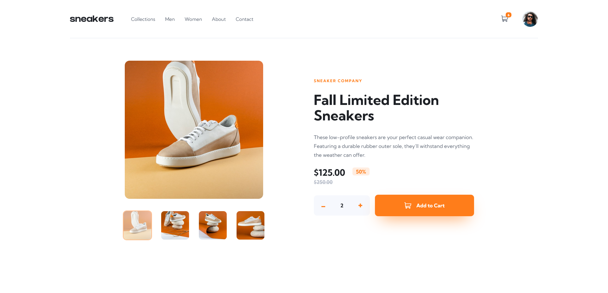
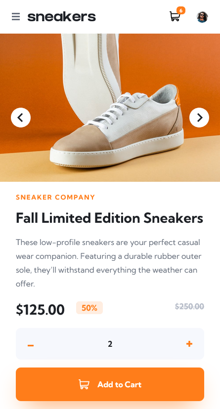
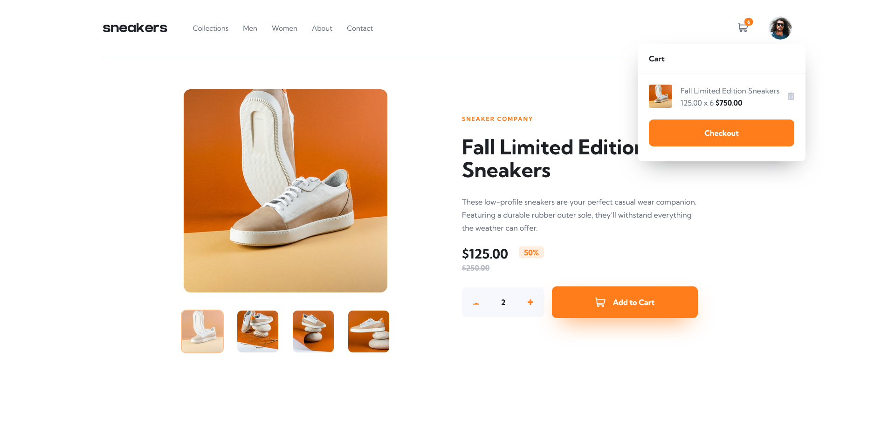
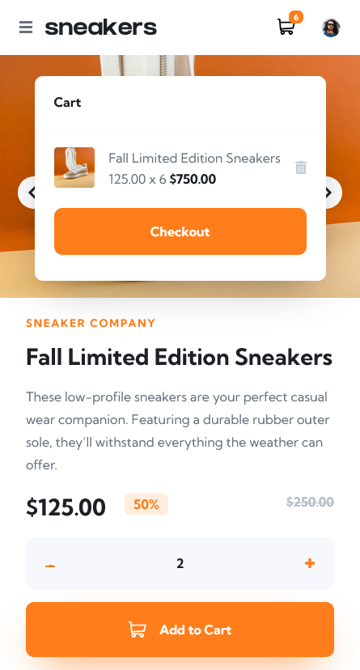

# Frontend Mentor - E-commerce product page solution

This is a solution to the [E-commerce product page challenge on Frontend Mentor](https://www.frontendmentor.io/challenges/ecommerce-product-page-UPsZ9MJp6). Frontend Mentor challenges help you improve your coding skills by building realistic projects.

## Table of contents

- [Overview](#overview)
  - [The challenge](#the-challenge)
  - [Screenshot](#screenshot)
  - [Links](#links)
- [My process](#my-process)
  - [Built with](#built-with)
  - [What I learned](#what-i-learned)
- [Author](#author)

**Note: Delete this note and update the table of contents based on what sections you keep.**

## Overview

### The challenge

Users should be able to:

- View the optimal layout for the site depending on their device's screen size
- See hover states for all interactive elements on the page
- Open a lightbox gallery by clicking on the large product image
- Switch the large product image by clicking on the small thumbnail images
- Add items to the cart
- View the cart and remove items from it

### Screenshot






### Links

- Live Site URL: [Github](https://github.com/Clytax/vite-sneaker)
- Solution URL: [Vercel](https://fm-ecommerce-clytax.vercel.app)

## My process

### Built with

- [React](https://reactjs.org/) - JS library
- [Vite](https://vitejs.dev/) - Build Tool
- [SCSS](https://sass-lang.com/) - For styles
- [Framer Motoion](https://www.framer.com/motion/) - For animations
- [Zustand](https://github.com/pmndrs/zustand) - For state management

### What I learned

I realised that I have gotten a lot faster and dont get stuck too often anymore! I also used this Hook that checks if someone clicked outside of a Component:

```JS
function useOutsideAlerter(ref) {
  const toggleCart = useCartStore((state) => state.toggleCart);
  const closeCart = useCartStore((state) => state.closeCart);
  useEffect(() => {
    /**
     * Alert if clicked on outside of element
     */
    function handleClickOutside(event) {
      if (ref.current && !ref.current.contains(event.target)) {
        closeCart();
      }
    }
    // Bind the event listener
    document.addEventListener("mousedown", handleClickOutside);
    return () => {
      // Unbind the event listener on clean up
      document.removeEventListener("mousedown", handleClickOutside);
    };
  }, [ref]);
}
```

### Continued development

I definitely need to learn more about CSS and responsive design. I'm still struggling with fluid widths and gaps. So I had to use multiple media queries to get the result I wanted.

## Author

- Youtube [Clytax](https://www.youtube.com/user/Mrshakeandplay)
- Frontend Mentor - [@Clytax](https://www.frontendmentor.io/profile/Clytax)
